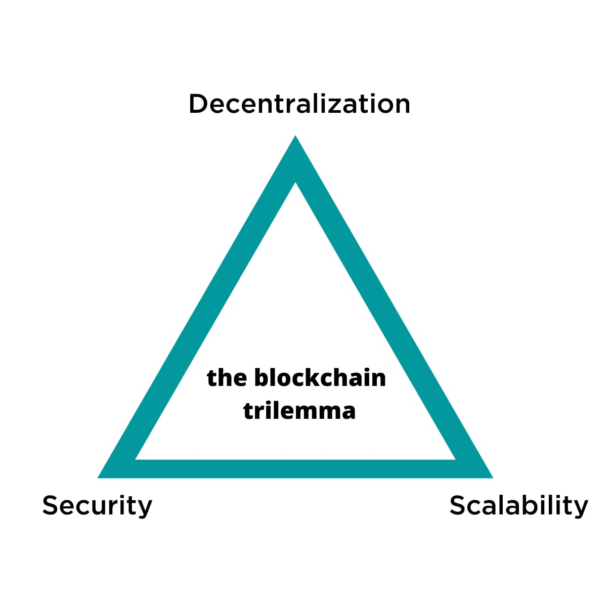
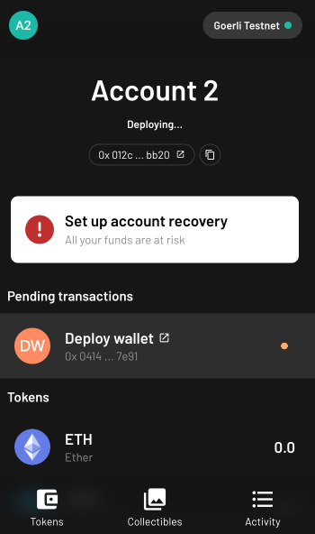
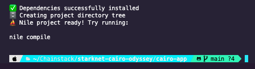
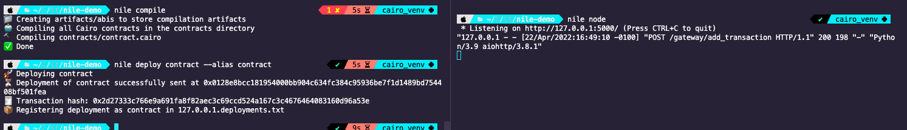
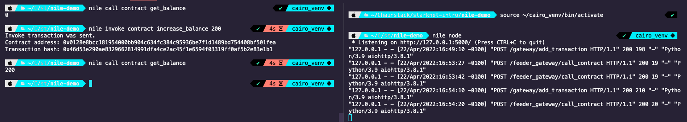

[StarkNet](https://starkware.co/starknet/) is a network for general purpose contracts written in Cairo and its mainnet has been live since December 2021. It is one of the most popular L2 solutions today and the latest protocol supported by Chainstack.

During the past few months, I've been reading articles, tweets and I even meet some of the StarkWare team members. The enthusiasm behind this project is huge so I decided to do some research, and try to create an app that runs on the StarkNet testnet.

However, before any of that, I knew that if I wanted to understand why layer two solutions are so popular, first I needed to know the problem they solve and how they do it. That's where the StarkNet Odyssey started for me 🚀 🪐

## The Ethereum scalability problem

Blockchains are decentralized systems. That means they do not rely on a single entity to validate transactions, they expect everyone to process every single transaction of the protocol.

That's one of the reasons why currently, Ethereum is not able to match the performance in transactions per second that "old-school" systems like Visa can process. In the blockchain trilemma, Ethereum went with decentralization and security over scalability.



Obviously, these **"old-school" systems lack the decentralization of Ethereum.** They rely on big data centers and databases that are controlled by a single entity. This difference is what Henri Lieutaud, from the StarkNet team, defined as "delegated accountability" (banks, Visa...) vs "inclusive accountability" (blockchains).

Blockchains that appeared years after Ethereum, like Solana and BSC, targeted the scaling problem by increasing the block size, which means more transactions can be processed in each block or reducing the number of validators in the network. Both things improve the throughput of the protocols (and the TPS), but at the same time, it reduces decentralization.

## Ethereum Layer 2 solutions

Layer two blockchains (or L2s) try to improve scalability in Ethereum by moving a lot of the heavy work of transactions and smart contract logic out of the Ethereum main net while keeping the same security. In addition to that, layer two solutions promise lower gas fees, which is one of the most important things.

But how do they do it? with Rollups. In a nutshell, rollups bundle multiple transactions together, settle them out of the main network, and send only the resulted state to Ethereum. There are two main types of rollups: optimistic and zero-knowledge. As we're focusing on StarkNet, we'll focus on zk-rollups.

## How ZK-Rollups work

**Zero-Knowledge Rollups or zk-proofs are a mathematical tool that allows systems to prove that certain transactions have been correctly settled and updated the state of the blockchain, without actually processing those transactions.**

Generating a zkProof requires certain computation power, but the advantage is that **verifying a proof requires less computation**, hence the savings in fees. In addition, the computation required to generate a proof and verify it grows logarithmically with the number of transactions included in a rollup, which means when more computation is required to generate a proof, it will require more computation to verify it but it will grow more slowly.

## StartkNet transaction lifecycle

When a transaction is submitted in StarkNet, it goes to a sequencer node (currently centralized and closed-source).

The sequencer takes batches of transactions and generates two things:

- a list of changes caused by all the transactions in the batch (changes in storage, balances, etc )
- a proof that, if all transactions included in the batch are executed successfully against the previous state of the network, the result will be the list of changes listed before.

After that, the proof and list of changes are sent to Ethereum where the rollup contract verifies them and updates the state.

The last part is important because that means that **all Ethereum nodes are actually StarkNet verifiers.** This also means that zk-proofs can be used in other EVM compatible blockchains and that StarkNet could potentially be deployed as an L2 solution for other protocols.

**In StarkNet, the transactions are not recorded on chain, only the state changes resulting from the transactions themselves are recorded on chain in L1.**

### Transaction fees in StarkNet

StarkNet fees are paid in ETH and the team released a [post about fees](https://community.starknet.io/t/fees-in-starknet-alpha/286) in which they indicate how StarkNet calculates fees for each transaction.

## The StarkNet toolkit

Using and developing in StarkNet requires you to know its own series of tools. Here are some of them:

### Explorer: Voyager

Voyager is the explorer for both [mainnet](https://voyager.online/) and [Goerli testnet](https://goerli.voyager.online/).

### Wallet: Argent-X

[ArgentX](https://argent.xyz/argent-x/) is an open-source browser wallet that has been created from scratch for StarkNet. ArgentX accounts are very different from Metamask accounts in Ethereum. In StarkNet, **accounts are smart contracts deployed in the network** that implements the [IAccount interface](https://github.com/OpenZeppelin/cairo-contracts/blob/main/src/openzeppelin/account/IAccount.cairo). Actually, if you search your account in Voyager, you'll see that it's a proxy contract that implements the code of the [account base contract](https://goerli.voyager.online/contract/0x70a61892f03b34f88894f0fb9bb4ae0c63a53f5042f79997862d1dffb8d6a30).

This allows **StarkNet accounts to have a lot of features like addresses not being derived from a public key, support for multicalls (multiple transactions in a single call), or even multiple signers** out of the box. As accounts are smart contracts, that means that when you create one, it takes a little bit to actually be deployed.



From a user's perspective, [ArgentX is a Chome extension](https://chrome.google.com/webstore/detail/argent-x-starknet-wallet/dlcobpjiigpikoobohmabehhmhfoodbb/) and behaves similar to Metamask. When you submit a transaction from a dApp, you'll see a pop-up to sign the transaction.

### Node clients: Pathfinder

Starknet nodes use the [pathfinder client](https://github.com/eqlabs/pathfinder#api) and they are similar to the nodes running GoEthereum although the exposed API only has methods to read from the blockchain as posting transactions is done via sequencers.

There is a [GitHub issue in the Pathfinder client repository](https://github.com/eqlabs/pathfinder/issues/240) that aims to allow transactions to be submitted to a node and then forward them to a sequencer, but it's still a work in progress.

**Sequencers are special StarkNet nodes that receive the transactions and generate the rollups.** These are currently run by Starknet and the code is not open source yet.

### Programming language: Cairo

[Cairo](https://www.cairo-lang.org/) is not a smart contract language like Solidity, it's a **general purpouse language that allows you to write programs that can be executed by a StarkNet prover and generates a proof that can be verified later on** by an Ethereum node.

Why use Cairo and not Solidity? It's needed to generate mathematical proofs. Cairo requires Python and although the programs are written using the Cairo language, tests are written in Python. It's similar to smart contracts written in Solidity and tests in Javascript.

### Framework: Nile

You can think of [Nile](https://github.com/OpenZeppelin/nile) as the Hardhat for StarkNet. It makes managing files and command-line calls to StarkNet very simple, and you can use it to bootstrap a new project.

## Developing in StarkNet

### Setting up the development environment

To install all the dependencies, we'll use [Homebrew](https://brew.sh/), so go ahead and install that first.

To develop programs for StarkNet we need Python 3.x Install it via homebrew with `brew install python@3.7`. Now I can run Python scripts using version 3.7 with `python3` in the terminal. For example `python3 --version`

Next, install pip with `python3 get-pip.py` after [downloading the installation script from here](https://pip.pypa.io/en/latest/installation/#get-pip-py). Pip is a package manager for Python, similar to NPM for JavaScript.

With Python and Pip ready to go, create a virtual environment with:

```
python3 -m venv ~/cairo_venv
source ~/cairo_venv/bin/activate
```

Now install dependencies required for Cairo with `pip3 install ecdsa fastecdsa sympy` and `brew install gmp`.

Next, install the Cairo language itself with `pip3 install cairo-lang`

If you have any issues, you can double-check these steps in [the official guide](https://www.cairo-lang.org/docs/quickstart.html).

### First steps with Nile

Nile is the toolbox that facilitates bootstrapping a Cairo project. To install it, run `pip install cairo-nile`. To initialize a project, just run `nile init`



Here are the main commands you can run with Nile:

- To compile the contract run `nile compile`. Compiled files will be in the `/artifacts` folder.
- To run a local node, run `nile node`.
- To run tests, use `pytest -s path/to/testfile`
- To deploy a contract run `nile deploy myContract --alias contract ` where the first "myContract" is the contract file name and the second, the alias you want to save it with.



- To interact with a deployed contract use `nile invoke` for @external functions or `nile call` for @view functions. For example, `nile invoke bank createAccount`



To deploy to the StarkNet mainnet, use `nile deploy my_contract --alias my_contract --network mainnet`

## Conclusion

In this first part of this series, we've reviewed what L2 solutions are and what problems they solve. We've also analyzed what are zero-knowledge proofs and how StarkNet uses them to validate transactions.

Now that we know all the different tools that we need to start developing in it and with the development environment setup, we're ready to create an app and deploy it to StarkNet test net. But that will be in part 2 of this StarkNet odyssey 🚀 🪐
