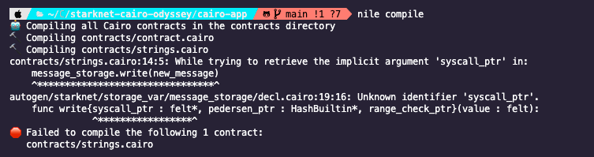
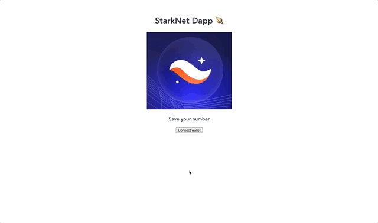

This is part two of the StarkNet odyssey series in which I explore the StarkNet L2 protocol. Make sure to [check part one of this series](https://chainstack.com/starknet-developer-introduction-part-1/) to get an overview of the protocol, understand what ZK-Proofs are, and learn about all the different tools you need to start developing on StarkNet.

In this article we'll review the fundaments of Cairo, the language used to write smart contracts in StarkNet, and we'll see how to interact with our contracts from a frontend app using the ArgentX Javascript library.

You can find all the code samples, contracts, and web app shown in this article [in the following GitHub repository](https://github.com/uF4No/starknet-cairo-odyssey).

## Cairo fundamentals

Cairo is... well, Cairo is hell. Although there is an [official Cairo 101 repository](https://github.com/starknet-edu/starknet-cairo-101) with code samples and contracts, the learning curve is super steep and understanding how things work can be very overwhelming.


So let's try to break down the most common paterns and **things that you need to know before you start to write a single line of code.**

### WTF is felt?

`felt` stands for Field Element is **the only data type in Cairo**. In simple terms, it's an unsigned integer with up to 76 decimals but it can also be used store addresses.

### Strings

**Currently, Cairo does not support strings.** It supports, however, short strings of up to 31 characters but they're actually stored in `felt`.

```php
#  = 448378203247
let hello_string = 'hello'
```

### Arrays

To working with arrays in Cairo you need a pointer that points to the start of the array, which is declared as a `felt*` using the `alloc` method.

Adding new elements to the array can be done using `assert` ([more on that later](#assertions)) and the pointer. See an example below:

```php
%lang starknet
%builtins range_check

# import to use alloc
from starkware.cairo.common.alloc import alloc

# view function that returns a felt and
# has range_check_ptr as an implicid argument
@view
func array_demo(index : felt) -> (value : felt):
    # Creates a pointer to the start of an array.
    let (my_array : felt*) = alloc()

    # sets 3 as the value of the first element of the array
    assert [felt_array] = 3
    # sets 15 as the value of the second element of the arrat
    assert [felt_array + 1] = 15
    # sets index 2 to value 33.
    assert [felt_array + 2] = 33
    assert [felt_array + 9] = 18
    # Access the list at the selected index.
    let val = felt_array[index]
    return (val)
end
```

If we try to read a value from an array at an invalid index, the program will fail with the following error: **Unknown value for memory cell at address**.

You can use arrays as function parameters or in returns, but when declaring it, you should indicate two parameters, the array's length, and the array itself. The naming convention is also important and should be `my_array_name` and `my_array_name_len`. For example:

```php
%lang starknet
%builtins pedersen range_check

from starkware.cairo.common.cairo_builtins import HashBuiltin

# Function that receives an array as parameter, so it actually receives the array length and # the array itself
@external
func array_play(array_param_len : felt, array_param : felt*) -> (res: felt):
    # read first element of the array
    let first = array_param[0]
    # read last element of the array
    let last = array_param[array_param_len - 1]

    let res = first + last

    return (res)
end
```

If you don't follow the proper naming convention, you'll get the following error from the compiler: **Array argument "array_param" must be preceded by a length argument named "array_param_len" of type felt.**

You can find an example to work with arrays in Cairo in [this cairo contract](./cairo-examples/contracts/arrays.cairo).

### Structs and Mappings

Structs are very similar to Solidity, we just have to define them with the `struct` keyword and define all its attributes as a `member`:

```php
# Account struct
struct Account:
    member isOpen: felt
    member balance: felt
end

```

To create a **mapping in Cairo** you have to define the types and use the `->` between the key and the value. For example:

```php
# Mapping named "accounts_storage" that holds the account details for
# each user using his address as key
@storage_var
func accounts_storage(address: felt) -> (account: Account):
end
```

We can also return structs from a Cairo function. You can find an example [in this code sample](./cairo-examples/contracts/structs-mappings.cairo)

### Declaring variables

Variables can be aliased, using the `let` keyword, or evaluated, using the `const`, `local` or `tempvar` keywords.

- `const` used for constants, can not be re-assigned.
- `local` used for local variables. Can not be re-assigned and require adding `alloc_locals` to the function
- `tempvar` used for temporary variables. They can be re-assigned.
- `let` used to create alias by value or by reference to another variables. Can be re-assigned.

Here are some examples of how to use each one of them:

```php
%lang starknet

# persistent state variable
@storage_var
func storage_variable() -> (res : felt):
end

func variable_examples{}():
  # required to use local variables
  alloc_locals

  # creating alias by value
  let a = 5
  let b = 3

  # creating alias by reference. x value is 5
  let x = a

  # constant, can not be re assigned
  const ten = 10

  # res is 15 here, 5 * 3
  tempvar res = a * b

  # local varible. c is 15
  local c = ten + a

  # re-assign aliased variable
  let b = 2

  # re-assign tempvar. res is 10 here, 5 * 2
  tempvar res = a * b

  return ()

end

```

Notice that in order to re-assign a variable, you have to indicate the variable type (`tempvar`, `let`).

### Storage variables: read and write

Contract state variables are called storage variables in Cairo. To define them, we need to use the `@storage_var` decorator and declare them as functions as follows:

```php
# Keeps a counter of the number of accounts
@storage_var
func number_of_accounts() -> (res: felt):
end

```

In order to read and write to storage variables, we need to use the `read` and `write` methods, making sure that the data type that we pass matches with the data type defined in the storage variable:

```php
# Keeps a counter of the number of accounts
@storage_var
func number_of_accounts() -> (res: felt):
end


# Creates an account for the user
@external
func readWriteAccounts{syscall_ptr : felt*, pedersen_ptr : HashBuiltin*, range_check_ptr}():

    // read number of accounts from storage
    let (n_accs) = number_of_accounts.read()

    // writes number of accounts in storage
    number_of_accounts.write(n_accs + 1)
    return ()
end

```

### Why is `{syscall_ptr : felt*, pedersen_ptr : HashBuiltin*, range_check_ptr}` in every method?

If you have read any Cairo contract you've probably found these line of code all over the place:`{syscall_ptr : felt*, pedersen_ptr : HashBuiltin*, range_check_ptr}`.

Those are implicid function arguments and they are used to access the state variables behind the scenes. In addition, `range_check_ptr` can be used to compare integers. Just remember to include them in your function declarations when you're reading or writing state varibles.

If you forget to include them, the compiler will fail with the following error: **Unknown identifier 'syscall_ptr' ... Unknown identifier 'syscall_ptr'** 😉



### Assertions

The `assert` statement is very useful but it can be used for two completely different things:

- to compare if the value of two variables is the same
- to set the value in a variable that has not been set before

See the example below:

```php
%lang starknet

@external
func demo_assert(guess : felt) :
    const a = 7

    tempvar b
    # verifies if the guess is 7
    assert a = guess
    # assigns 5 to variable b
    assert b = 5
    # verifies if the guess is 5
    assert b = guess

    return ()
end

```

For other assertions, you can import different methods from the `starkware.cairo.common.math` library like `assert_not_zero`, `assert_in_range`, `assert_not_equal`, `assert_le` and `assert_lt`. For example:

```php
%lang starknet

from starkware.cairo.common.math import (
  assert_not_equal,
        assert_in_range
        assert_not_zero,
        assert_lt,
        assert_le,
)

@external
func assertions_demo(a: felt, b: felt):

    assert_not_zero(a)
    assert_not_equal(b, a)
    assert_le(1, 100)
    assert_lt(b, 1)
    assert_in_range(b, 1, 60)

    return ()
end
```

### Contract functions

Cairo contract functions are declared with the `@external` or `@view` decorators. External functions can be called by users or by other contracts while view functions are similar but they only query the contract state and do not alter it.

```php
# view function that returns the number of accounts from the storage variable
@view
func accountsOpen{syscall_ptr : felt*, pedersen_ptr : HashBuiltin*, range_check_ptr}() -> (res: felt):
    let (res) = number_of_accounts.read()
    return (res)
end

# Creates an account for the user and updates the storage variable
@external
func openAccount{syscall_ptr : felt*, pedersen_ptr : HashBuiltin*, range_check_ptr}():
    let (sender_address) = get_caller_address()
    # checks if the user already has an account
    let (user_account) = accounts_storage.read(sender_address)
    assert user_account.isOpen = 0
    let (n_accs) = number_of_accounts.read()

    accounts_storage.write(sender_address, Account(isOpen=1, balance=0))
    number_of_accounts.write(n_accs + 1)
    return ()
end
```

Returned values must be indicated in the function declaration, and wraped in parenthesis in the body, even if the function does not return anything 😉

### Contract structure

Contracts in Cairo have a similar structure to contracts writen in Solidity. It'll contain the following:

1. language declaration `%lang starknet`
2. imports
3. structs and state variables
4. contract methods

### Messaging between L1-L2

One of the cool things your can do with Cairo is sending messages between StarkNet (L2) and Ethereum (L1).

You'd need to deploy a contract in StarkNet and use the `send_message_to_l1` function which takes as parameteres the address of the contract that is going to receive the message in the L1 and the payload.

You'll also need to deploy a contract in Ethereum that implements the interface [IStarknetCore](https://www.cairo-lang.org/docs/hello_starknet/index.html#starknet-alpha-on-mainnet) which has the methods `sendMessageToL2` and `consumeMessageFromL2`.

You can find a [step-by-step tutorial about L1-L2 messaging in our docs](https://docs.chainstack.com/tutorials/starknet/nft-contract-with-nile-and-l1-l2-reputation-messaging#prerequisites).

## Interacting with contracts

You can interact with contracts directly from [Voyager](https://voyager.online/), the official explorer.

When it comes to interact with StarkNet contracts from a web application, there are two main options: starknet.js and @argent/get-starknet.

The first one is a standalone Javascript library that you can use in both front and back end applications. You can find the [API documentation here](https://www.starknetjs.com/docs/API/).

The second one is a light wrapper that makes it easier to interact with the wallet, although it uses the `starknet.js` library as a peer dependency so the API to interact with contracts it's the same.

### Web app example

I've created a Vue.js web app to showcase how to interact with a contract deployed to StarkNet. You can [find the code in the following repository](https://github.com/uF4No/starknet-cairo-odyssey/).

The `@argent/get-starknet` makes it super simple to connect a wallet and, by default, includes a pop-up that allows users to use both ArgentX or Braavos wallets.



Here's a quick code snippet that shows how to connect to the user's wallet:

```js
import { connect } from '@argent/get-starknet'

let starknet = null

const connectWallet = async () => {
  starknet = await connect()
  console.log('startknet >>', starknet)

  if (!starknet) {
    throw Error(
      'User rejected wallet selection or silent connect found nothing'
    )
  }

  await starknet.enable()

  // Check if connection was successful
  if (starknet.isConnected) {
    console.log('starknet connected')
  } else {
    console.log('starknet wallet not connected')
  }
}
```

Once your app is connected to the user's wallet, you can use it to interact with contracts using the `starknet.account.callContract` function for view methods, or `starknet.account.execute` for external methods. Both require an object with the following properties:

- `contractAddress`
- `entrypoint` which is the method name we want to call.
- `calldata` an array with all the parameteres we want to send. (optional)

Here is an example to use both:

```js
const CONTRACT_ADDRESS =
  '0x07955c619cb22d08ece120ef4f5faa531318ac9934018ef28fdae9284b831b4d'

// Reads from the chain using callContract
const getUserNumber = async () => {
  try {
    const res = await starknet.provider.callContract({
      contractAddress: CONTRACT_ADDRESS,
      entrypoint: 'get_number',
    })
    console.log('res', res)
    savedNumber.value = Number(`${res.result[0]}`)
  } catch (error) {
    console.error(error)
  }
}

// Writes on-chain using execute
const saveNumber = async () => {
  try {
    const trxDetails = await starknet.account.execute({
      contractAddress: CONTRACT_ADDRESS,
      entrypoint: 'save_number',
      calldata: [userNum.value],
    })
    console.log('trxDetails', trxDetails)
  } catch (error) {
    console.error(error)
  }
}
```

## StarkNet Python library

If you prefer to use Python in your StarkNet projects, [StarkNet.py](https://github.com/software-mansion/starknet.py) is what you need. It offers both synchronous and asynchronous methods to interact with contracts and query the blockchain.

### Conclusion

I hope this help you kick-start your projects in StarkNet and solve any doubts you might have about how to start developing apps in it.

L2 solutions are becoming more and more popular and StarkNet is one of the most active ones, with hackathons taking place almost every month. The team has recently launched [StarkGate](https://starkgate.starknet.io/), a bridge to move ETH to StarkNet and the adoption has been great so more applications will be available soon.
